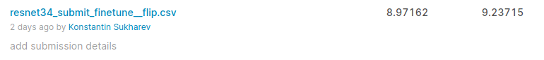

# Thousand Facial Landmarks Competition

В репозитории код решения соревнования в рамках курса MADE по компьютерному зрению.

## Описание решения

Обучение бейзлайна в течение 10 эпох дало 12.7 на паблике :)

Переписал бейзлайн, чтобы использовать imgaug. Поэксперементировал с аугментациями, лучше всего показало себя аффинное преобразование и кроп по центру. Обучил ResNeXt50 - 11.6 на паблике.

Решил попробовать [WingLoss](https://github.com/elliottzheng/AdaptiveWingLoss/) c ResNeXt50 - score 10.6.

Захотелось обучить State-of-the-art :) Поискал статьи, наткнулся на [HRNet](https://arxiv.org/pdf/1908.07919.pdf). Взял реализацию на [github](https://github.com/HRNet/HRNet-Facial-Landmark-Detection) Допилил голову, чтобы из heatmap'ов получать точки. 10.6 на паблике.

Эксперименты c EfficientNet не дали улучшений.

После всех этих экспериментов, решил сделать флип картинок по горизонтали и обучить ResNet34 c флипом и без него с MSE лоссом. Получил хороший результат на локальной валидации в обоих случаях. Причем без флипа немного лучше. Дотюнил лучший чекпоинт с OneCycleLR scheduler в течение 4 эпох с флипом и без. Лучше получилось с флипом - 9.24 на паблике и 8.97 на private lb.

